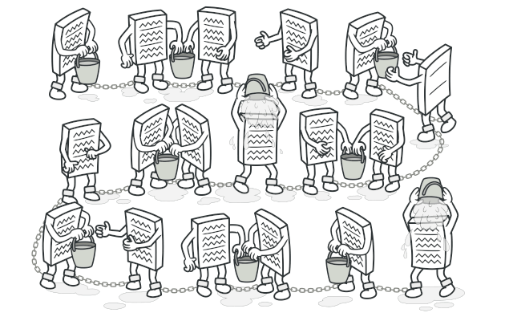
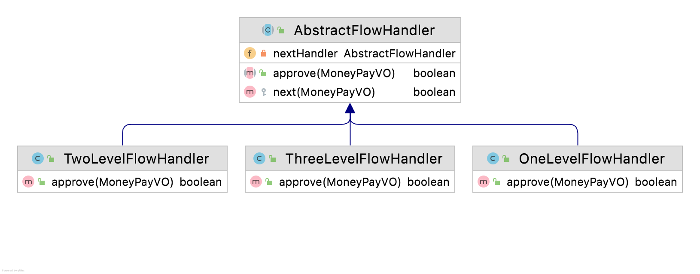

# 责任链模式

代码千万条，规范第一条。编码不规范，维护时两行泪。

# 一、简介

责任链模式，简而言之，就是将多个操作组成一条链路进行处理。请求在链路上传递，链路上的每一个节点就是一个处理器，每个处理器都可以对请求进行处理，或者传递给链路上的下一个处理器处理。




# 二、应用场景

责任链模式的应用场景，在实际工作中，通常有如下两种应用场景。

1. 操作需要经过一系列的校验，通过校验后才执行某些操作。
2. 工作流。企业中通常会制定很多工作流程，一级一级的去处理任务。


下面通过两个案例来学习一下责任链模式。


## 案例一：创建商品多级校验场景

以创建商品为例，商品创建逻辑分为以下三步完成：①创建商品、②校验商品参数、③保存商品。

校验商品步骤又分为多种情况的校验，必填字段校验、规格校验、价格校验、库存校验等等。这些检验逻辑像一个链路一样，以下使用`责任链模式`重构校验商品参数这段逻辑。


**伪代码如下：**

创建商品步骤，需要经过一系列的参数校验，如果参数校验失败，直接返回失败的结果；通过所有的参数校验后，最终保存商品信息。


如上代码看起来非常工整，而且看起来也很清晰。（PS：我没有把所有的校验代码都罗列在一个方法里，那样更能产生对比性，但我觉得抽象并分离单一职责的函数应该是每个程序员最基本的要求）

但是随着业务需求不断地叠加，相关的校验逻辑也越来越多，新的功能使代码越来越**臃肿**，**可维护性较差**。更糟糕的是，这些校验组件**不可复用**，当你有其他需求也需要用到一些校验时，你又变成了`Ctrl＋C` , `Ctrl＋V`程序员，系统的维护成本也越来越高。如下图所示，伪代码和上边一个思路，这里就不赘述了。


终于有一天，你忍无可忍了，决定重构这段代码。

**使用责任链模式优化**：创建商品的每个校验步骤都可以作为一个单独的`**处理器**`，抽离为一个单独的类，便于**复用**。这些处理器形成一条链式调用，请求在处理器链上传递，如果校验条件不通过，则处理器不再向下传递请求，直接返回错误信息；若所有的处理器都通过检验，则执行保存商品步骤。


## 案例一实战：码之


### UML图：一览众山小


`AbstractCheckHandler`表示处理器抽象类，负责抽象处理器行为。其有3个子类，分别是：

1. `NullValueCheckHandler`：空值校验处理器
2. `PriceCheckHandler`：价格校验处理
3. `StockCheckHandler`：库存校验处理器

`AbstractCheckHandler`抽象类中，**`abstract Result handle()`**定义了处理器的抽象方法，其子类需要重写`handle()`方法以实现特殊的处理器逻辑；

**`protected ProductCheckHandlerConfig config`**是处理器的动态配置类，使用`protected`声明，每个子类处理器都持有该对象。该对象用于声明配置当前处理器、以及当前处理器的下一个处理器`nextHandler`，另外也可以配置一些特殊属性，比如说`接口降级`配置、`超时时间`配置等。

**`AbstractCheckHandler nextHandler`**`;`是当前处理器持有的下一个处理器的引用；

**`protected Result next()`**是执行下一个处理器的方法，使用`protected`声明，每个子类处理器都持有该对象。当子类处理器执行完毕(通过)时，调用父类的方法执行下一个处理器`nextHandler`。

**`HandlerClient`**是执行处理器链路的客户端，`HandlerClient.executeChain()`方法负责发起整个链路调用，并接收处理器链路的返回值。


撸起袖子开始撸代码吧~


### 商品参数对象：保存商品的入参

`ProductVO`是创建商品的参数对象，包含商品的基础信息。并且其作为多个处理器的入参，多个处理器都以`ProductVO`为入参进行特定的逻辑处理。实际业务中，商品对象特别复杂。咱们化繁为简，简化商品参数如下：

```Java
/**
 * 商品对象
 */
@Data
@Builder
public class ProductVO {
    /**
     * 商品SKU，唯一
     */
    private Long skuId;
    /**
     * 商品名称
     */
    private String skuName;
    /**
     * 商品图片路径
     */
    private String imgPath;
    /**
     * 价格
     */
    private BigDecimal price;
    /**
     * 库存
     */
    private Integer stock;
}
```


### 抽象类处理器：抽象行为，子类共有属性、方法

`AbstractCheckHandler`：处理器抽象类，并使用`@Component`注解注册为由`Spring`管理的`Bean`对象，这样做的好处是，我们可以轻松的使用`Spring`来的管理、引用这些处理器`Bean`。

```Java
/**
 * 抽象类处理器
 */
@Component
public abstract class AbstractCheckHandler {

    /**
     * 当前处理器持有下一个处理器的引用
     */
    @Getter
    @Setter
    protected AbstractCheckHandler nextHandler;


    /**
     * 处理器配置
     */
    @Setter
    @Getter
    protected ProductCheckHandlerConfig config;

    /**
     * 处理器执行方法
     * @param param
     * @return
     */
    public abstract Result handle(ProductVO param);

    /**
     * 链路传递
     * @param param
     * @return
     */
    protected Result next(ProductVO param) {
        //下一个链路没有处理器了，直接返回
        if (Objects.isNull(nextHandler)) {
            return Result.success();
        }

        //执行下一个处理器
        return nextHandler.handle(param);
    }

}
```


`AbstractCheckHandler`抽象类处理器中，使用`protected`声明子类可见的属性和方法。使用`@Component注解`，声明其为`Spring`的`Bean`对象，这样做的好处是可以利用Spring轻松管理所有的子类，下面会展示如何使用。抽象类的属性和方法说明如下：

- `public abstract Result handle()`：表示抽象的校验方法，每个处理器都应该继承`AbstractCheckHandler`抽象类处理器，并重写其`handle`方法，各个处理器从而实现特殊的校验逻辑。
- `protected ProductCheckHandlerConfig config`：表示每个处理器的动态配置类，可以通过“配置中心”动态修改该配置，实现处理器的“动态编排”和“顺序控制”。配置类中可以配置处理器的名称、下一个处理器、以及处理器是否降级等属性。

`ProductCheckHandlerConfig配置类` :

```Java
/**
 * 处理器配置类
 */
@AllArgsConstructor
@Data
public class ProductCheckHandlerConfig {
    /**
     * 处理器Bean名称
     */
    private String handler;
    /**
     * 下一个处理器
     */
    private ProductCheckHandlerConfig next;
    /**
     * 是否降级
     */
    private Boolean down = Boolean.FALSE;
}
```


- `protected AbstractCheckHandler nextHandler`：表示当前处理器持有下一个处理器的引用，如果当前处理器`handle()`校验方法执行完毕，则执行下一个处理器的`handle()`方法执行校验逻辑。
- `protected Result next(ProductVO param)`：此方法用于处理器链路传递，子类处理器执行完毕后，调用父类的`next`方法执行在`config` 配置的链路上的下一个处理器，如果所有处理器都执行完毕了，就返回结果了。


### 子类处理器：处理特有的校验

`AbstractCheckHandler`抽象类处理器有3个子类分别是：

1. `NullValueCheckHandler`：空值校验处理器
2. `PriceCheckHandler`：价格校验处理
3. `StockCheckHandler`：库存校验处理器

各个处理器继承`AbstractCheckHandler`抽象类处理器，并重写其`handle()`处理方法以实现特有的校验逻辑。


- `NullValueCheckHandler`：空值校验处理器。针对创建商品中的入参处理空值校验。如果校验未通过，则返回错误码`ErrorCode`，责任链在此截断，创建商品返回校验的错误信息。**注意代码中的降级配置**！`super.getConfig().getDown()`是用来获取父类中保存的配置信息，如果处理器配置了降级，则跳过该处理器，调用`super.next()`执行下一个处理器逻辑。

使用`@Component`注册为由`Spring`管理的`Bean`对象，

```Java
/**
 * 空值校验处理器
 */
@Component
public class NullValueCheckHandler extends AbstractCheckHandler{

    @Override
    public Result handle(ProductVO param) {
        System.out.println("空值校验 Handler 开始...");
        
        //降级：如果配置了降级，则跳过此处理器，执行下一个处理器
        if (super.getConfig().getDown()) {
            System.out.println("空值校验 Handler 已降级，跳过空值校验 Handler...");
            return super.next(param);
        }
        
        //参数必填校验
        if (Objects.isNull(param)) {
            return Result.failure(ErrorCode.PARAM_NULL_ERROR);
        }
        //SkuId商品主键参数必填校验
        if (Objects.isNull(param.getSkuId())) {
            return Result.failure(ErrorCode.PARAM_SKU_NULL_ERROR);
        }
        //Price价格参数必填校验
        if (Objects.isNull(param.getPrice())) {
            return Result.failure(ErrorCode.PARAM_PRICE_NULL_ERROR);
        }
        //Stock库存参数必填校验
        if (Objects.isNull(param.getStock())) {
            return Result.failure(ErrorCode.PARAM_STOCK_NULL_ERROR);
        }
        
        System.out.println("空值校验 Handler 通过...");
        
        //执行下一个处理器
        return super.next(param);
    }
}

```


- `PriceCheckHandler`：价格校验处理。针对创建商品的价格参数进行校验。这里只是做了简单的判断价格>0的校验，实际业务中比较复杂，比如“价格门”这些防范措施等。

```Java
/**
 * 价格校验处理器
 */
@Component
public class PriceCheckHandler extends AbstractCheckHandler{
    @Override
    public Result handle(ProductVO param) {
        System.out.println("价格校验 Handler 开始...");

        //非法价格校验
        boolean illegalPrice =  param.getPrice().compareTo(BigDecimal.ZERO) <= 0;
        if (illegalPrice) {
            return Result.failure(ErrorCode.PARAM_PRICE_ILLEGAL_ERROR);
        }
        //其他校验逻辑...

        System.out.println("价格校验 Handler 通过...");

        //执行下一个处理器
        return super.next(param);
    }
}
```


- `StockCheckHandler`：库存校验处理器。针对创建商品的库存参数进行校验。

```Java
/**
 * 库存校验处理器
 */
@Component
public class StockCheckHandler extends AbstractCheckHandler{
    @Override
    public Result handle(ProductVO param) {
        System.out.println("库存校验 Handler 开始...");

        //非法库存校验
        boolean illegalStock = param.getStock() < 0;
        if (illegalStock) {
            return Result.failure(ErrorCode.PARAM_STOCK_ILLEGAL_ERROR);
        }
        //其他校验逻辑..

        System.out.println("库存校验 Handler 通过...");

        //执行下一个处理器
        return super.next(param);
    }
}
```


### 客户端：执行处理器链路

`HandlerClient`客户端类负责发起整个处理器链路的执行，通过`executeChain()`方法。如果处理器链路返回错误信息，即校验未通过的信息，则整个链路截断，返回错误信息。

```Java
public class HandlerClient {

  public static Result executeChain(AbstractCheckHandler handler, ProductVO param) {
      //执行处理器
      Result handlerResult = handler.handle(param);
      if (!handlerResult.isSuccess()) {
          System.out.println("HandlerClient 责任链执行失败返回：" + handlerResult.toString());
          return handlerResult;
      }
      return Result.success();
  }
}
```


以上，责任链模式相关的类已经创建好了。接下来就可以创建商品了。


### 创建商品：函数

`createProduct()`创建商品方法抽象为2个步骤：`①参数校验`、`②创建商品`。参数校验使用责任链模式进行校验，包含：`空值校验`、`价格校验`、`库存校验`等等，只有链上的所有处理器均校验通过，才调用`saveProduct()`创建商品方法；否则返回校验错误信息。在`createProduct()`创建商品方法中，通过责任链模式，我们将校验逻辑进行解耦。`createProduct()`创建商品方法中无需关注都要经过哪些校验处理器，以及校验处理器的细节。

```Java
/**
 * 创建商品
 * @return
 */
@Test
public Result createProduct(ProductVO param) {

    //参数校验，使用责任链模式
    Result paramCheckResult = this.paramCheck(param);
    if (!paramCheckResult.isSuccess()) {
        return paramCheckResult;
    }

    //创建商品
    return this.saveProduct(param);
}
```


### 参数校验：责任链模式

参数校验`paramCheck()`方法使用责任链模式进行参数校验，方法内没有声明具体都有哪些校验，这些参数校验逻辑是通过多个处理器链传递的。如下：

```Java
/**
 * 参数校验：责任链模式
 * @param param
 * @return
 */
private Result paramCheck(ProductVO param) {

    //获取处理器配置：通常配置使用统一配置中心存储，支持动态变更
    ProductCheckHandlerConfig handlerConfig = this.getHandlerConfigFile();

    //获取处理器
    AbstractCheckHandler handler = this.getHandler(handlerConfig);

    //责任链：执行处理器链路
    Result executeChainResult = HandlerClient.executeChain(handler, param);
    if (!executeChainResult.isSuccess()) {
        System.out.println("创建商品 失败...");
        return executeChainResult;
    }

    //处理器链路全部成功
    return Result.success();
}
```


`paramCheck()`方法步骤说明如下：


**步骤1：获取处理器配置**。

通过`getHandlerConfigFile()`方法获取处理器配置，配置保存了链上各个处理器的上下级节点配置，支持**流程编排**、**动态扩展**。通常配置是保存在`Ducc(京东自研的配置中心)`、`Nacos(阿里开源的配置中心)`等配置中心的，支持**动态变更**、**实时生效**。基于此，我们便可以实现校验处理器的编排、以及动态扩展了。我这里没有使用配置中心存储处理器链路的配置，而是使用`JSON`串的形式去模拟配置，大家感兴趣的可以自行实现。

```Java
/**
 * 获取处理器配置：通常配置使用统一配置中心存储，支持动态变更
 * @return
 */
private ProductCheckHandlerConfig getHandlerConfigFile() {
    //配置中心存储的配置
    String configJson = "{\"handler\":\"nullValueCheckHandler\",\"down\":true,\"next\":{\"handler\":\"priceCheckHandler\",\"next\":{\"handler\":\"stockCheckHandler\",\"next\":null}}}";
    //转成Config对象
    ProductCheckHandlerConfig handlerConfig = JSON.parseObject(configJson, ProductCheckHandlerConfig.class);
    return handlerConfig;
}
```


`ConfigJson`存储的处理器链路配置`JSON`串，在代码中可能不便于观看，我们可以使用[json.cn](json.cn)等格式化看一下，如下，配置的整个调用链路规则特别清晰。


**步骤2：根据配置获取处理器**。

通过`getHandlerConfigFile()`方法获取到处理器链路配置规则后，通过`getHandler()`根据处理器链路配置规则获取处理器。`getHandler()`参数是如上`ConfigJson`配置的规则。根据配置的规则，转换成处理器链路对象。代码如下：

```Java
/**
 * 使用Spring注入:所有继承了AbstractCheckHandler抽象类的Spring Bean都会注入进来。Map的Key对应Bean的name,Value是name对应相应的Bean
 */
@Resource
private Map<String, AbstractCheckHandler> handlerMap;

/**
 * 获取处理器
 * @param config
 * @return
 */
private AbstractCheckHandler getHandler (ProductCheckHandlerConfig config) {
    //配置检查：没有配置处理器链路，则不执行校验逻辑
    if (Objects.isNull(config)) {
        return null;
    }
    //配置错误
    String handler = config.getHandler();
    if (StringUtils.isBlank(handler)) {
        return null;
    }
    //配置了不存在的处理器
    AbstractCheckHandler abstractCheckHandler = handlerMap.get(config.getHandler());
    if (Objects.isNull(abstractCheckHandler)) {
        return null;
    }
    
    //处理器设置配置Config
    abstractCheckHandler.setConfig(config);
    
    //递归设置链路处理器
    abstractCheckHandler.setNextHandler(this.getHandler(config.getNext()));

    return abstractCheckHandler;
}
```


**步骤2-1：配置检查。**

代码14~27行，进行了配置的一些检查操作。如果配置错误，则获取不到对应的处理器。代码23行`handlerMap.get(config.getHandler())`是从所有处理器映射`Map`中获取到对应的处理器`Spring Bean`。

`handlerMap`存储了所有的处理器映射，是通过`Spring` `@Resource`**注解注入**进来的。所有继承了`AbstractCheckHandler`抽象类（它是Spring管理的Bean）的子类（子类也是Spring管理的Bean）都会注入进来。

注入进来的`handlerMap`中 `Map`的`Key`对应`Bean`的`name`，`Value`是`name`对应的`Bean`实例，也就是实际的处理器，这里指空值校验处理器、价格校验处理器、库存校验处理器。这样根据配置中`handler:"priceCheckHandler"`的配置，使用`handlerMap.get(config.getHandler())`便可以获取到对应的处理器。


**步骤2-2：保存处理器规则。**

代码29行，将配置规则保存到对应的处理器中`abstractCheckHandler.setConfig(config)`，子类处理器就持有了配置的规则。


**步骤2-3：****递归设置处理器链路****。**

代码32行，**递归设置链路上的处理器**。

`//递归设置链路处理器<br />abstractCheckHandler.setNextHandler(this.getHandler(config.getNext()));`

这一步可能不太好理解，结合`ConfigJson`配置的规则来看，似乎就很很容易理解了。


`NullValueCheckHandler` 空值校验处理器通过`setNextHandler()`方法设置自己持有的下一节点的处理器，也就是价格处理器`PriceCheckHandler`。

`PriceCheckHandler`价格处理器，同样需要经过`步骤2-1配置检查`、`步骤2-2保存配置规则`，并且最重要的是，它也需要设置下一节点的处理器`StockCheckHandler`库存校验处理器。

库存校验处理器也一样，同样需要经过`步骤2-1配置检查`、`步骤2-2保存配置规则`，但请注意`StockCheckHandler`的配置，它的`next`规则配置了`null`，这表示它下面没有任何处理器要执行了，它就是整个链路上的最后一个处理节点。

通过递归调用`getHandler()`获取处理器方法，就将整个处理器链路串联起来了。

❗**友情提示**：递归虽香，但使用递归一定要注意截断递归的条件处理，否则可能造成死循环哦！

实际上，`getHandler()`获取处理器的代码就是把在配置中心配置的规则`ConfigJson`，转换成实际的处理器对象，这个处理器对象持有了整个链路的调用顺序。


**步骤3：客户端执行调用链路**。

```Java
public class HandlerClient {

  public static Result executeChain(AbstractCheckHandler handler, ProductVO param) {
      //执行处理器
      Result handlerResult = handler.handle(param);
      if (!handlerResult.isSuccess()) {
          System.out.println("HandlerClient 责任链执行失败返回：" + handlerResult.toString());
          return handlerResult;
      }
      return Result.success();
  }
}
```


`getHandler()`获取完处理器后，整个调用链路的执行顺序也就确定了，此时，客户端该登场了！

`HandlerClient.executeChain(handler, param)`方法是`HandlerClient`客户端执行整个调用链路的。

`executeChain()`通过`AbstractCheckHandler.handle()`触发整个链路处理器顺序执行，如果某个处理器校验没有通过，则返回错误信息；所有处理器都校验通过，则执行`saveProduct()`方法保存商品。


### 总结：串联方法调用流程

基于以上，再通过流程图来回顾一下方法的调用流程。如果有没理解的小伙伴，可以在回顾一下整个流程。


### 测试🐥：代码执行结果

场景1：`创建商品`参数中有空值（如下`skuId`参数为`null`），链路被空值处理器截断，返回错误信息。

```Java
//创建商品参数
ProductVO param = ProductVO.builder()
      .skuId(null).skuName("华为手机").imgPath("http://...")
      .price(new BigDecimal(1))
      .stock(1)
      .build();
```


运行结果：


场景2：`创建商品`价格参数异常（如下`price`参数），被价格处理器截断，返回错误信息

```Java
ProductVO param = ProductVO.builder()
      .skuId(1L).skuName("华为手机").imgPath("http://...")
      .price(new BigDecimal(-999))
      .stock(1)
      .build();
```


场景2测试结果：


场景 3：`创建商品`库存参数异常（如下`stock`参数），被库存处理器截断，返回错误信息。

```Java
//创建商品参数，模拟用户传入
ProductVO param = ProductVO.builder()
      .skuId(1L).skuName("华为手机").imgPath("http://...")
      .price(new BigDecimal(1))
      .stock(-999)
      .build();
```


场景3测试结果：


场景4：`创建商品`所有处理器校验通过，保存商品。

```Java
//创建商品参数，模拟用户传入
ProductVO param = ProductVO.builder()
      .skuId(1L).skuName("华为手机").imgPath("http://...")
      .price(new BigDecimal(999))
      .stock(1).build();
```


场景4测试结果：


## 案例二：工作流，费用报销审核流程


同事小贾最近刚出差回来，她迫不及待的就提交了费用报销的流程。根据金额不同，分为以下几种审核流程。报销金额低于1000元，三级部门管理者审批即可，1000到5000元除了三级部门管理者审批，还需要二级部门管理者审批，而5000到10000元还需要一级部门管理者审批。即分为以下几种情况：

1. 小贾需报销500元，三级部门管理者审批即可。
2. 小贾需报销2500元，三级部门管理者审批通过后，还需要二级部门管理者审批，二级部门管理者审批通过后，才完成报销审批流程。
3. 小贾需报销7500元，三级管理者审批通过后，并且二级管理者审批通过后，流程流转到一级部门管理者进行审批，一级管理者审批通过后，即完成了报销流程。


### UML图

`AbstractFlowHandler`作为处理器抽象类，抽象了`approve()`审核方法，一级、二级、三级部门管理者处理器继承了抽象类，并重写其`approve()`审核方法，从而实现特有的审核逻辑。



配置类如下所示，每层的处理器都要配置审核人、价格审核规则（审核的最大、最小金额）、下一级处理人。配置规则是可以动态变更的，如果三级部门管理者可以审核的金额增加到2000元，修改一下配置即可动态生效。


代码实现与案例一相似，感兴趣的自己动动小手吧~


# 三、责任链的优缺点

优点

1. 降低耦合度。分离了请求与处理，无需关注责任链是如何传递处理的，以及处理器的细节。
2. 可以按需控制请求处理的顺序，实现流程编排。
3. 扩展性高。可以动态的新增或减少处理器，不需要改动核心流程代码。


缺点

1. 请求在链中传递，代码没有直接码出来那么直观。并且代码调试时不是很方便。
2. 请求可能因责任链配置错误导致无法正确处理。
3. 如果责任链配置错误，可能会造成循环链，造成死循环。


